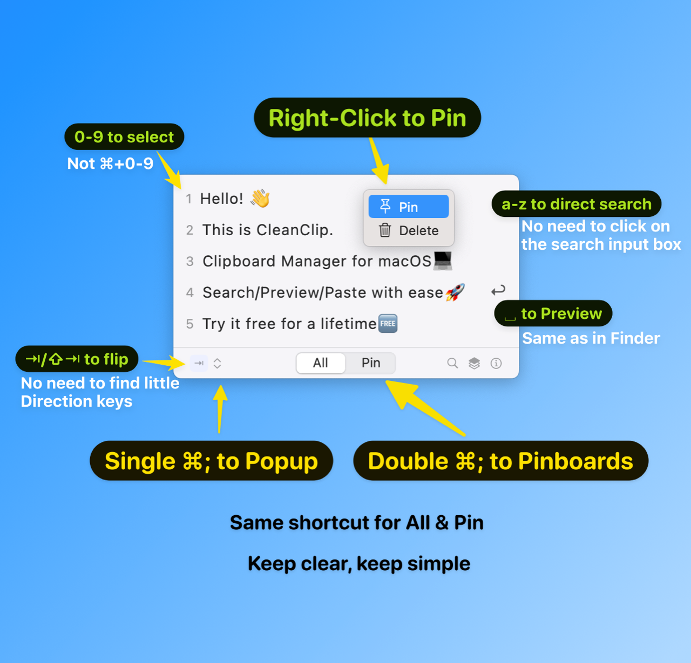

# CleanClip 的快捷键设计

CleanClip 的快捷键设计原则遵循：
- 1️⃣ 非必要不增加新的快捷键
- 2️⃣ 尽最大可能使按键最少
- 3️⃣ 尽量保持既有的快捷键习惯

图中的快捷键中：
- 同一个快捷键 ⌘; 单击/双击展示不同选项卡，遵循原则 1。
- 0-9 选择选项而不是 ⌘+0-9，遵循原则 2。
- ␣ 预览，遵循原则 3。
- a-z 直接搜索遵循原则 1/2。

