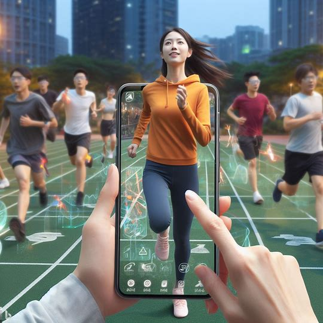

# AR+ 影子跑步怎么样？提升陪伴+趣味性+竞技性

玩过赛车游戏的朋友对影子模式应该都不陌生：游戏程序把玩家的行驶记录幻化成一个虚拟对手，和自己进行比赛。

这么做的好处是：
1. 你可以不断挑战自己，在每次超越自己都能获得一次超越灵感
2. 不断挑战同一个高手，从影子学习别人的技术
3. 单机状态下，让影子陪伴自己
4. 状态不好时避免竞争压力

## 影子模式结合跑步 App 的好处？

上面的好处仍然适用：
1. 对于想要提升、或较为专业的跑步者，可以在跑步过程中观察自己过去的和其它专业选手的跑步节奏。
2. 单身状态下，让他人的影子陪伴自己。
3. 对于休闲跑者特别是新手，初期容易掌握不好节奏，导致太快崩盘。用影子模式可以很容易可以找个水平领先自己一个阶段的人跟着，不担心被拉爆。

## 怎么结合 AR 呢？
如果想更有趣：把影子设计成可爱的 3d 卡通角色，抬起手机📱扫视路线能发现正在路线上跑步的角色。
把手机往方向甩可以向他扔一个香蕉皮，然后看到它摔倒的可爱动画等等。

更实用：考虑到我们不可能一直抬头看手机，当我们超越或被超越时，手机给出震动和语音提示。

你可以设定要跟踪的人，app 根据你俩的步频、步幅、当前心率等数据给出智能建议，比如“稍微降低步幅，提高步频就可以跟上他了”。

竞技性：
可以实时知道当前排名，随时看到其它人的跑步状态。

拓展
降阶版：无需 ar，地图上加个头像也可以实现。
升阶版：vision pro 的 mr 版本，真正的超级虚拟世界！不过这要等 vision pro 轻薄到足够带着跑步，怀念 Google glass 一秒。

