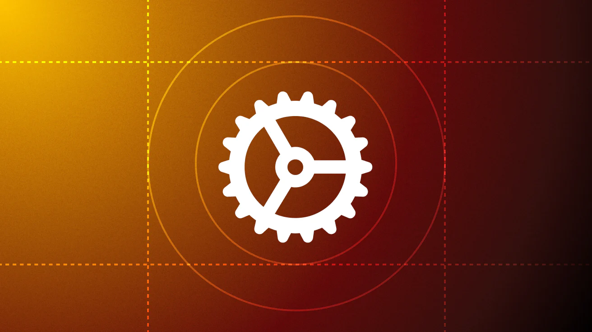

# Getting Started with SwiftUI Animations: Rotation

**Learn how to get started with SwiftUI animations and make a simple rotation animation for an image.**



This developer tutorial comes first in a series that will guide you through creating seven different kinds of animations in SwiftUI using [Shapes](https://developer.apple.com/documentation/swiftui/shape), the Path tool, and other animation properties. Throughout this series you will learn to animate various properties of a 2D shape, including:

- Width and Height
- Line width
- Outlines
- Dash, dash phase, stroke start, and stroke end.
In addition, the tips, and tricks, you learn in this tutorial will get you up and running with animations in SwiftUI in general. Today, we're getting started with the basics of animation and a usage example.

## Creating your First SwiftUI Animation
Let's build a looping rotational animation using the settings icon.

Generally, animation takes place when an object is changed over time. To change views over time in SwiftUI, you need what is called a state variable. This property wrapper will be used to set the initial and end states of the animation.

Follow the steps below to rotate the icon endlessly using animation. To start, create a blank SwiftUI project or a view file in Xcode and name it RotationAnimation.swift. Now you can start by adding the gear icon using SF Symbols.

```swift
import SwiftUI
 
struct RotationAnimation: View {
    var body: some View {
        Image(systemName: "gear")
            .font(.system(size: 64))
    }
}
```
Now let's begin building the animation.

First, define the following state variable in the declaration section of your content view and set the initial state as double.

```swift
@State private var isRotating = 0.0
In SwiftUI, you can trigger animations in several ways using gestures. In this example, you will trigger the animation automatically when the gear icon appears. To do this, you should attach the .onAppear modifier to the icon and set the final state of the animation. The animation will undergo one complete revolution, so set its final state to 360° using the state variable you already defined isRotating = 360.0.
.onAppear {
    isRotating = 360.0
}
```
In SwiftUI views, only @State and observed properties can be mutated.

In SwiftUI, you can create animations implicitly or explicitly. In implicit animation, the animation modifier must be directly attached to the view you want to animate. On the other hand, an explicit animation is declared using withAnimation. To see the animation in action, embed the final animation state in withAnimation and set the animation easing using linear interpolation. This is intentional because the gear icon should be rotating at a constant speed – therefore, linear is the best option.

```swift
.onAppear {
    withAnimation(.linear(duration: 1)
            .speed(0.1).repeatForever(autoreverses: false)) {
        isRotating = 360.0
    }
}
```
Finally, since you are interested in creating a rotational animation, you should attach the rotation effect modifier to the icon and use the state variable to change it over time with .rotationEffect(.degrees(isRotating)).
Let's put it all together:

struct RotationAnimation: View {
    @State private var isRotating = 0.0
 
    var body: some View {
        Image(systemName: "gear")
            .font(.system(size: 64))
            .rotationEffect(.degrees(isRotating))
            .onAppear {
                withAnimation(.linear(duration: 1)
                        .speed(0.1).repeatForever(autoreverses: false)) {
                    isRotating = 360.0
                }
            }
    }
}
That's it, you have successfully created your first SwiftUI animation! Pretty easy, huh?